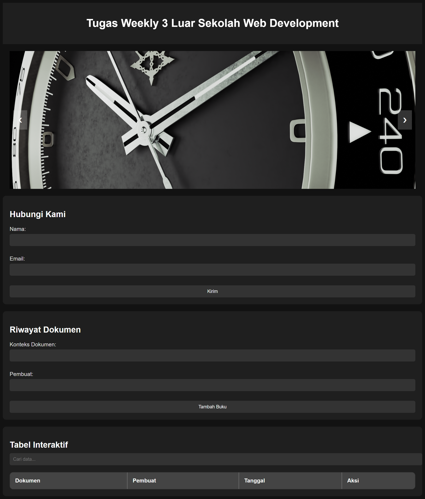

# Tugas 1: JavaScript

## 📌 Informasi Peserta
- **Nama**: Andhika Septian Prayoga  
- **Okupasi**: Web Development  

---

## 📋 Detail Tugas
Dalam tugas ini, peserta diminta untuk membuat beberapa fungsi JavaScript yang mencakup:
1. **Fungsi untuk manipulasi DOM** (menambahkan elemen, menghapus elemen, atau mengubah konten elemen).
2. **Fungsi untuk validasi formulir** (contoh: validasi email atau input kosong).
3. **Fungsi untuk pengolahan data array atau objek** (contoh: filter, map, atau reduce).
4. **Event handling** untuk interaksi pengguna (contoh: klik tombol, hover, atau input).

Peserta bebas menambahkan fitur lain sesuai kebutuhan.

---

## 🖥️ Source Code JavaScript
```javascript
let slideIndex = 0;
const slides = document.querySelectorAll(".slides");

function showSlide(n) {
    slides.forEach(slide => slide.style.display = "none");
    slides[n].style.display = "block";
}

function changeSlide(n) {
    slideIndex += n;
    if (slideIndex >= slides.length) slideIndex = 0;
    if (slideIndex < 0) slideIndex = slides.length - 1;
    showSlide(slideIndex);
}

function autoSlide() {
    changeSlide(1);
    setTimeout(autoSlide, 2000);
}

showSlide(slideIndex);
setTimeout(autoSlide, 2000);

function toggleMenu() {
    const menu = document.querySelector('.menu');
    if (menu.style.display === 'flex') {
        menu.style.display = 'none';
    } else {
        menu.style.display = 'flex';
    }
}

function searchTable() {
    const input = document.getElementById('searchInput');
    const filter = input.value.toLowerCase();
    const rows = document.querySelectorAll("#dataTable tbody tr");

    rows.forEach(row => {
        const cells = row.getElementsByTagName('td');
        let match = false;
        for (let cell of cells) {
            if (cell.innerText.toLowerCase().includes(filter)) {
                match = true;
                break;
            }
        }
        row.style.display = match ? '' : 'none';
    });
}

function addBookToTable() {
    const title = document.getElementById('book-title').value;
    const author = document.getElementById('author').value;
    const date = new Date().toISOString().split('T')[0];

    if (title === '' || author === '') {
        alert('Semua kolom harus diisi!');
        return false;
    }

    const tableBody = document.querySelector("#dataTable tbody");
    const row = document.createElement("tr");

    row.innerHTML = `
        <td>${title}</td>
        <td>${author}</td>
        <td>${date}</td>
        <td>
            <button onclick="editRow(this)">Edit</button>
            <button onclick="deleteRow(this)">Hapus</button>
        </td>
    `;

    tableBody.appendChild(row);

    document.getElementById('book-title').value = '';
    document.getElementById('author').value = '';

    return false;
}

function editRow(button) {
    const row = button.parentElement.parentElement;
    const cells = row.getElementsByTagName('td');

    const title = cells[0].innerText;
    const author = cells[1].innerText;

    document.getElementById('book-title').value = title;
    document.getElementById('author').value = author;

    row.remove();
}

function deleteRow(button) {
    const row = button.parentElement.parentElement;
    row.remove();
}

// Pop-up message for "Hubungi Kami" form
function validateForm() {
    const name = document.getElementById('name').value;
    const email = document.getElementById('email').value;

    if (name === '' || email === '') {
        alert('Semua kolom harus diisi!');
        return false;
    }

    // Show pop-up message
    alert(`Terima kasih, ${name}! Kami akan segera menghubungi Anda di ${email}.`);
    return false; // Prevent form submission
}
```

---

## 📸 Screenshot Tampilan JavaScript

